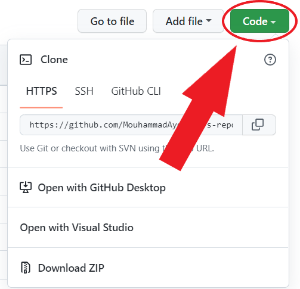

<a name="readme-top"></a>


# Library-Management-System</br>&nbsp;&nbsp;&nbsp;

> Welcome aboard fellow developer, this is where you will find projects which you are free to contribute to. You can contribute by submitting your own scripts, which you think would be amazing for other people to see.

### Description

Desktop application built with ***JavaFX*** and ***MSSQL*** designed to manage all the functions of a library. It helps the librarian to maintain the database of new books and borrowed books along with their due dates. It tracks the records of the number of books in the library, how many books are issued, how many books have been returned or renewed.

### Installation

Download the project from github to your desktop:

  - **With Git** :
      If you’re familiar with git and have it installed on your computer, you can clone the repository to download the files.
      
      **1.** Click the green button labeled &nbsp;`Code`</br>
      
      &nbsp;&nbsp;&nbsp;&nbsp;&nbsp;&nbsp;&nbsp;&nbsp;&nbsp;&nbsp;&nbsp;&nbsp;&nbsp;&nbsp;&nbsp;&nbsp;</br>
      
      **2.** Copy the URL of the repository</br>
      
      **3.** Next, on your local machine, open your bash shell and change your current working directory to the location where you would like to clone your repository
      ```shell
      cd "path-to-your-folder"
      ```
      
      **4.** Once you have navigated to the directory where you want to put your repository, you can use
      ```shell
      git clone https://github.com/MouhammadAyoub/Library-Management-System.git
      ```
      
      **5.** When you run `git clone https://github.com/MouhammadAyoub/Library-Management-System.git`, You should see output like
      ```shell
      Cloning into 'test-repo'...
      remote: Counting objects: 5, done.
      remote: Compressing objects: 100% (4/4), done.
      remote: Total 5 (delta 0), reused 0 (delta 0), pack-reused 0
      Unpacking objects: 100% (5/5), done.
      Checking connectivity... done.
      ```
      </br>
      
  - **Without Git** :
      When downloading materials to your laptop, it is easiest to download the entire repository.
      
      **1.** Click on the green `Code` button, then download the repository as a ZIP file</br>
      
      &nbsp;&nbsp;&nbsp;&nbsp;&nbsp;&nbsp;&nbsp;&nbsp;&nbsp;&nbsp;&nbsp;&nbsp;&nbsp;&nbsp;&nbsp;&nbsp;</br>
      
      **2.** Find the downloaded .zip file on your computer, likely in your Downloads folder</br>
      
      **3.** Unzip it, this will create a folder named after the GitHub repository</br></br>

  - **Steps you must do to make the app work properly** :
      
      **1.** Change the server name of the `ConnectionStrings` attribute in the `appsetting.json` file</br>

<p align="right">(<a href="#readme-top">back to top</a>)</p>

### Usage

test test

<p align="right">(<a href="#readme-top">back to top</a>)</p>

### Contribution Guidelines

The contribution guidelines are as per the guide [HERE](https://github.com/MouhammadAyoub/Library-Management-System/blob/main/CONTRIBUTING.md).

<p align="right">(<a href="#readme-top">back to top</a>)</p>

### Instructions

- Fork this repository
- Clone your forked repository
- Add your scripts
- Commit and push
- Create a pull request
- Star this repository
- Wait for pull request to merge
- Celebrate your first step into the open source world and contribute more

<p align="right">(<a href="#readme-top">back to top</a>)</p>

### License

Distributed under the MIT License. See `LICENSE` for more information.

<p align="right">(<a href="#readme-top">back to top</a>)</p>

### Contact

- Email&nbsp;&nbsp;&nbsp;&nbsp;&nbsp;&nbsp;&nbsp;&nbsp;&nbsp;&nbsp;&nbsp;:&nbsp;&nbsp;[mouhammad.ayoub@outlook.com](mailto:mouhammad.ayoub@outlook.com)

- Project Link : &nbsp;[https://github.com/MouhammadAyoub/Library-Management-System](https://github.com/MouhammadAyoub/Library-Management-System)

<p align="right">(<a href="#readme-top">back to top</a>)</p>

## Additional tools to help you get Started with Open-Source Contribution

* [How to Contribute to Open Source Projects – A Beginner's Guide](https://www.freecodecamp.org/news/how-to-contribute-to-open-source-projects-beginners-guide/)
* [How to Write a Good README File for Your GitHub Project](https://www.freecodecamp.org/news/how-to-write-a-good-readme-file/)

#### Note: When you add a project, add it to the README for ease of finding it.
#### Note: Please do not have the project link reference your local forked repository. Always link it to this repository after it has been merged with main.

<p align="right">(<a href="#readme-top">back to top</a>)</p>

-----------
